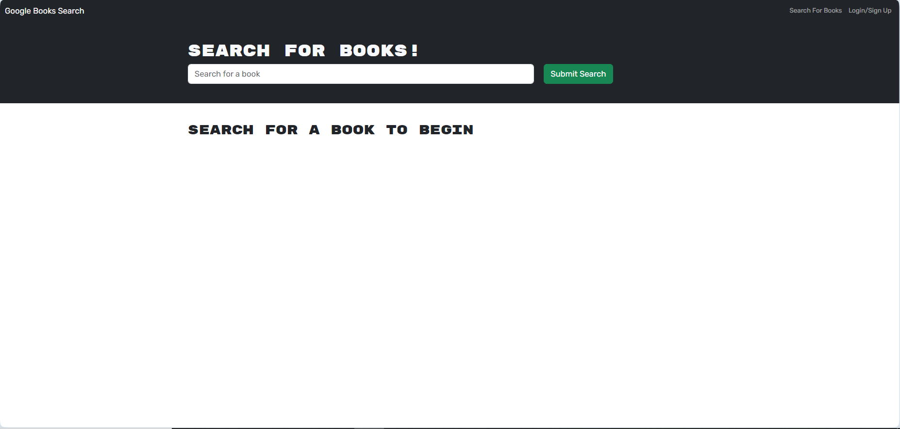
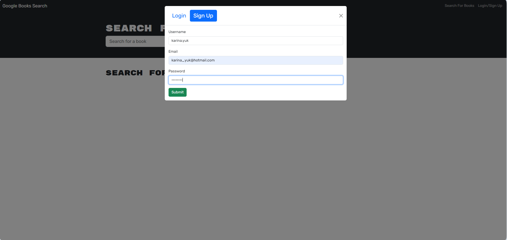
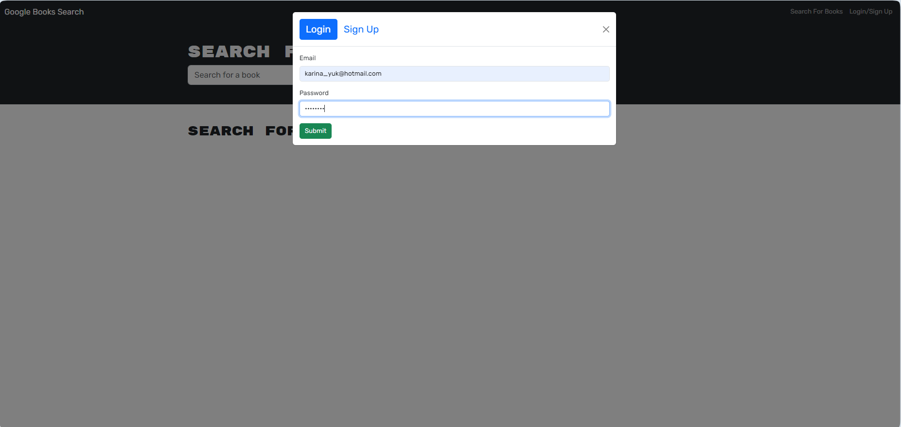
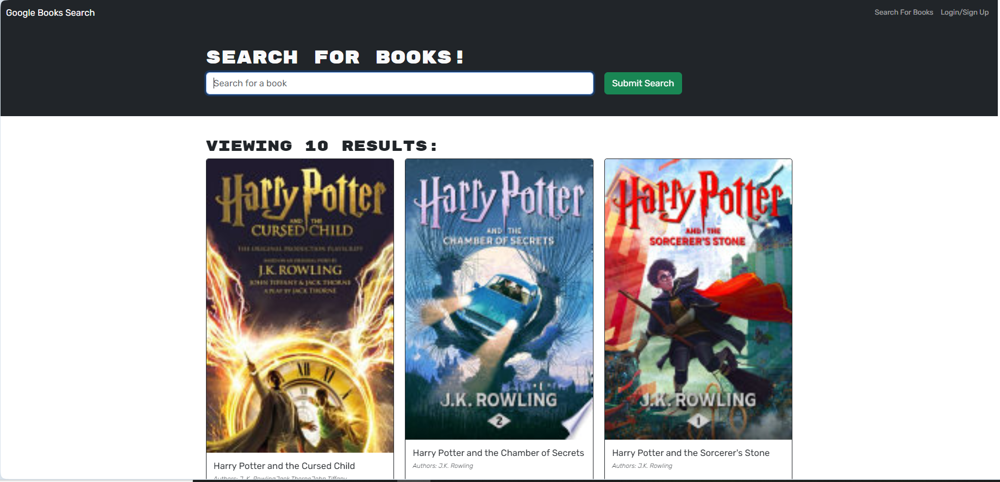
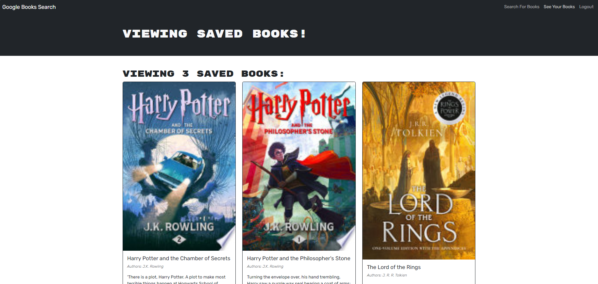
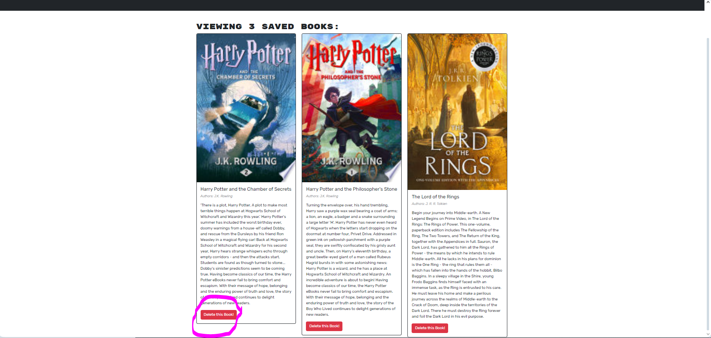

# kb-books-finder

## Description

"This application is a book search engine crafted using the MERN stack (MongoDB, Express.js, React, Node.js), it allow users to explore books from the Google Books API. This project was initially structured with a RESTful API design, the project underwent a refactor to adopt GraphQL alongside Apollo Server, enhancing both performance and adaptability. With GraphQL, users can seamlessly retrieve and manipulate data through queries and mutations, resulting in a more efficient user experience."

## Table of Contents

- [Installation](#installation)
- [Application Sample](#application-sample)
- [Reference](#reference)
- [License](#license)
- [Questions](#questions)

## Installation

No installation needed. To access the application, please visit: 

## Application Sample

Sample image of the application shown :

1. Homepage

2. Signup and Login

3. Search Book and save button

4. Saved Books and delete button

## Reference

- [React](https://reactjs.org/)
- [Node.js](https://nodejs.org/en/) 
- [Express](https://expressjs.com/)
- [MongoDB](https://www.mongodb.com/)

## License

MIT license was used for this application.

## Questions

For any questions, please contact me at <karina.yukting.li@gmail.com>.
GitHub Profile: https://github.com/karina-yuk

